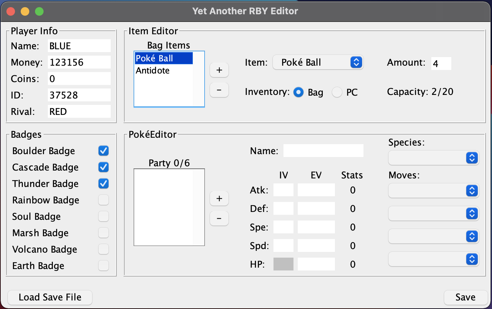

# Pokémon Genration I Save Editor
A Java based Save Editor for the generation I Pokémon games. 

**NOTE: Currently a work in progress and in a relatively rough state.**

## Features
- Edit info about your player character such as:
  - Name
  - Rival Name
  - Money
  - GameCorner Coins
  - Trainer ID
  - Badges
- Easily get the rarest items in the game
- Edit your party Pokémon to make them more powerful (Not Yet Implemented)

## Motivation
Wanting to learn more about how the older Pokémon games stored their data, I decided to create an application 
to edit that data to better understand how those games worked at a a deeper level. I also pursued this project to learn a bit more about Java and OOP.

## References
- [Pokemon Generation I Data Structure](https://bulbapedia.bulbagarden.net/wiki/Pokémon_data_structure_(Generation_I)#6-Pok.C3.A9mon_Party_Structure) - Bulbapedia
- [Pokemon Generation I Save Data Structure](https://bulbapedia.bulbagarden.net/wiki/Save_data_structure_(Generation_I)) - Bulbapedia

